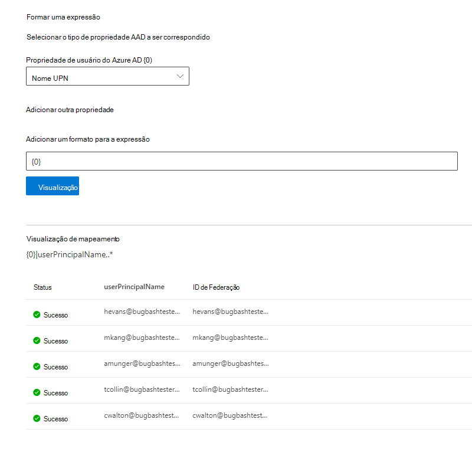

# Mapear suas identidades do Azure AD  

Este artigo apresenta as etapas de mapeamento de suas identidades do Azure AD para um identificador exclusivo para sua fonte de dados (identidade não-Azure AD) para que as pessoas em sua lista de controle de acesso (ACL) com identidades não do Azure AD possam ver os resultados de pesquisa do conector com escopo.

Essas etapas só são relevantes para os administradores de pesquisa que estão Configurando um conector [Salesforce](salesforce-connector.md) pela Microsoft com permissões de pesquisa para "apenas pessoas com acesso a esta fonte de dados" e tipo de identidade "AAD". As etapas a seguir explicam como mapear suas propriedades de usuário do Azure AD para as **IDs de Federação** dos usuários.

>[!NOTE]
>Se você estiver configurando [um conector do Salesforce](salesforce-connector.md) e selecionar **apenas as pessoas com acesso a essa fonte de dados** e tipo de identidade **não-AAD** na tela de permissões de pesquisa, consulte o artigo [map your non-Azure ad Identities](map-non-aad.md) para obter etapas sobre como mapear identidades não pertencentes ao Azure AD.  

## Etapas para mapeamento de suas propriedades do Azure AD

### 1. selecionar Propriedades de usuário do Azure AD para mapear

Você pode selecionar as propriedades do Azure AD que você precisa mapear para a ID de Federação.

Você pode selecionar uma propriedade de usuário do Azure AD na lista suspensa. Você também pode adicionar tantas propriedades de usuário do Azure AD quantas quiser se essas propriedades forem necessárias para criar o mapeamento de ID de Federação para sua organização.

### 2. criar fórmula para concluir o mapeamento

Você pode combinar os valores das propriedades de usuário do Azure AD para formar a ID de Federação exclusiva.

Na caixa Fórmula, " {0} " corresponde à *primeira* Propriedade do Azure AD que você selecionou. " {1} " corresponde à *segunda* Propriedade do Azure AD que você selecionou. " {2} " corresponde à *terceira* Propriedade do Azure AD e assim por diante.  

Veja a seguir alguns exemplos de fórmulas com exemplos de resultados de expressões regulares e saídas de fórmulas:

| Fórmula de exemplo                  | Valor da propriedade {0} de um usuário de amostra                 | Valor da propriedade {1} de um usuário de amostra           | Saída da fórmula                  |
| :------------------- | :------------------- |:---------------|:---------------|
| {0}.{1} @contoso. com  | FirstName | LastName |firstname.lastname@contoso.com
| {0}@domain. com                 | ID                 |             |userid@domain.com

Depois de fornecer sua fórmula, você pode, opcionalmente, clicar em **Visualizar** para ver uma visualização de cinco usuários aleatórios da fonte de dados com seus respectivos mapeamentos de usuários aplicados. A saída da visualização inclui o valor das propriedades de usuário do Azure AD selecionadas na etapa 1 para esses usuários e a saída da fórmula final fornecida na etapa 2 para esse usuário. Também indica se a saída da fórmula pode ser resolvida para um usuário do Azure AD no locatário por meio de um ícone de "sucesso" ou "falha".  

>[!NOTE]
>Você ainda pode prosseguir com a criação de sua conexão se um ou mais mapeamentos de usuário tiverem um status de "falha" após você clicar em **Visualização**. A visualização mostra 5 usuários aleatórios e seus mapeamentos da fonte de dados. Se o mapeamento fornecido não mapear todos os usuários, você pode experimentar esse caso.

## Exemplo de mapeamento do Azure AD

Confira o instantâneo abaixo para obter um exemplo de mapeamento do Azure AD.

## Limitações  

- Só há suporte para um mapeamento para todos os usuários. Não há suporte para mapeamentos condicionais.  

- Não é possível alterar o mapeamento depois que a conexão é publicada.  

- Não há suporte para as expressões baseadas em Regex nas propriedades de usuário do Azure AD para a transformação de ID de Federação do Azure AD.